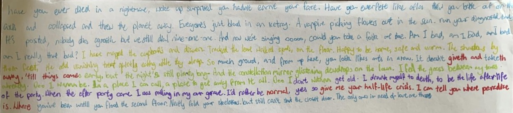

<picture>
 <source media="(prefers-color-scheme: dark)" srcset="Screenshot_20230712_100407_Crusaders.jpg" width="100%" height="40px">
 <source media="(prefers-color-scheme: light)" srcset="1B8EBF01-DC24-4FFB-8252-8E53EA232CB8.png"width="100%" height="40px">
 
</picture>

# KitC_Adventures
This repository contains a collection of text-based adventure games written in Python, as side branches for **Kings in the Corner** fan-content. These games aims to be interactive stories that allow the *you* to explore different scenarios, making choices that affect the outcome. :)

## Welcome the **KitC_Adventures** repository. 
> *Ong KitC Text adventures fr??   Made by **Lazice** in collaboration with **ApplTcake**.*
> Me(lazice) and Tcake(appltcake) made this to be silly. <333 💟

Nearly everything placed here are non-canonical, there will be introductions to how they differentiate from the canon. 

## How to play? 
Download, uh, everything. Then run luci death dialogue.py  in any program that can run python. :)

(Like, a slight overview of what it's about. heart emoji:heart:)
